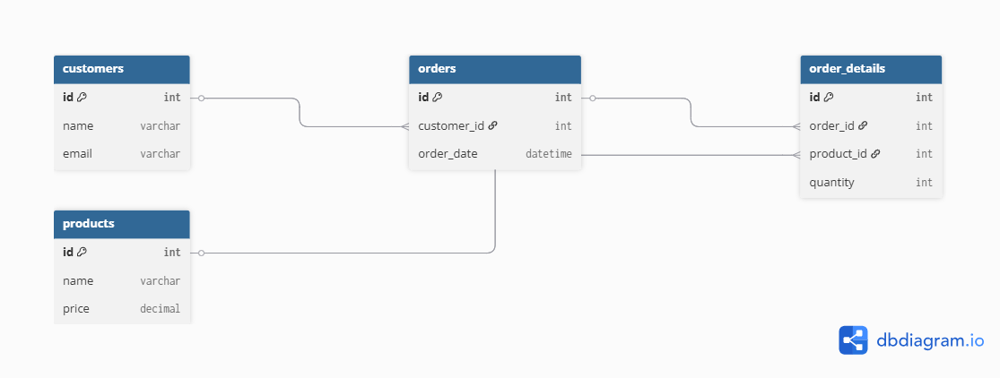

# 🛒 E-Commerce Database Project

This mini project demonstrates an e-commerce database system using MySQL. It includes table creation (schema) and sample queries that showcase practical business logic.

## 📦 Schema Includes:
- **Customers**
- **Products**
- **Orders**
- **OrderDetails**

## 📊 Key Features:
- Track orders made by customers
- Manage inventory stock levels
- Calculate total sales per customer
- Join queries with real-world use cases

## 🧪 Run Instructions:
- Import `ecommerce_schema.sql` to create tables
- Populate with sample data (optional)
- Use `ecommerce_queries.sql` to run useful business queries

## 📈 ERD Diagram

## 🧑‍💻 Author:
Rashi Aggarwal  
Final Year B.Tech CSE Student  
📍 Panipat, Haryana  
📧 rashiaggarwalofficial@gmail.com
